# Semana 3: Circuitos Arduino

## Arduino 

Arduino es una plataforma que nos facilita hacer proyectos de automatización y electrónica, basada en hardware y software libre con código igualmente libre.

## ¿Cómo usar Arduino?

1.- **Instalar**: Aúnque sea redundante también es bueno poner este paso primero, ya que para usar arduino obviamente primero hay que instalarlo por lo que para eso deberás ir al sitio ofical de arduino en el cual buscarás el partado para instalar la versión ofical de arduino, ahí te dejara instalar múltiples versiones de arduino. dependiendo de tu dispositivo (dependiendo de su sitema operativo), con la posibilidad de incluso instalaer versiones pasadas incluso si así lo deseas. Los últimos pasos son dar los npermisos necesarios para que arduino funcvione de manera apropiada en tu dispositivo.

2.- **Interfaz**: Cuando abreas ya la aplicación de arduino podrás ver lo que yo dividiría de cuatro maneras: interfaz código, primera barra superior, segunda barra superior y barra lateral izquierda.

3.- **Interfaz Código**: por default ya hay una base para crear un código y es el apartado que abarca más espacio de la pantalla en el cual tendrás que escribir el código que quieres subir o programar, ya que sirve tanto para subir el código a una tarjeta compatible, como para compilar un código y hacer simulaciones simples.
```yml
void setup() {
  // put your setup code here, to run once:

}

void loop() {
  // put your main code here, to run repeatedly:

}
```
4.- **1° Barra Superior**: en este apartado podrás encontrar apartados de configuración en general de la aplicación como lo es: file (administrar archivos), edit (modificar archivos), sketch (configuración general para programar) y help (informaión de todo tipo).

5.- **2° Barra Supeior**: en esta sección encontraremos cuatro opciones a la izquieda que son verify (compilar tu código), upload (subir tu código a una tarjeta), debug (corregir errorews pero no lo he usado), y select board (seleccionar el tipo de tarjeta que estás usadno). Después están los dos opciones de la derecha que son serial plotter y serial monitor (ambas sirven para simular tu código).

6.- **Barra Lateral Izquierda**: Tines por nopciones sketch book (archivos arduino y nube), boards manager(instalar otras posibles tarjetas arduino), library manager (instalr loibrerias que son código prehecho para no programar desde cero), debug (corregir errores del cóidigo) y search (buscar cualquier funión de la aplicación por si no sabes donde se encuentra).

## Componentes y Materiales 

- **Tarjeta Arduino Uno**: El Arduino Uno es una placa electrónica de desarrollo basada en un microcontrolador que permite conectar el mundo físico con el código de programación de forma sencilla. 


- **Cable USB-A - USB-B**: Es un cable que conecta un ordenador u otro dispositivo central a un periférico grande mediante dos tipos de conectores diferentes en sus extremos.


- **Protoboard**:  Es una placa plástica con orificios interconectados internamente por láminas metálicas que permite armar y probar circuitos eléctricos de forma temporal sin necesidad de soldar.


- **Jumpers**: Es un cable eléctrico delgado que tiene un conector en cada extremo, diseñado para hacer conexiones rápidas sin necesidad de soldar.


- **Leds**: Es un pequeño dispositivo semiconductor que emite luz cuando pasa una corriente eléctrica a través de él.


- **Push Button**: Es un pequeño dispositivo semiconductor que emite luz cuando pasa una corriente eléctrica a través de él.


- **Resistencias**: Es un componente que se opone al flujo de la corriente eléctrica.


- **Display de 7 segmentos**: Es un componente electrónico que sirve para mostrar números y algunos caracteres mediante siete líneas o segmentos que se encienden o apagan.


- **Servomotores**: Es un motor eléctrico especial que permite controlar con exactitud la posición angular, la velocidad y la aceleración de su eje. 


- **Potenciometro**: Es una resistencia eléctrica variable que permite ajustar de forma manual el voltaje o la corriente en un circuito.


- **Fuente de Poder de 3 Canales**: Es un dispositivo que entrega tres salidas de energía independientes o multicanal desde una sola unidad.


## 1° Circuito

Tinker

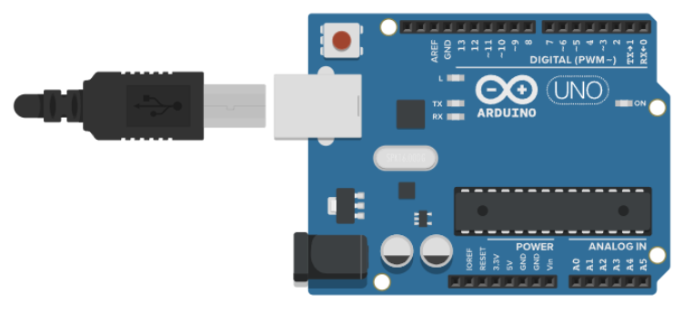

Foto


**Video:**[Video del circuito 1 funcionando (YouTube)](https://youtu.be/wxzb1nuZ_Fw?si=5iwkVhriuLhPJsmM)

Código

```yml
url: "https://TU_USUARIO.github.io"
baseurl: "/TU_REPO"
```

## 2° Circuito

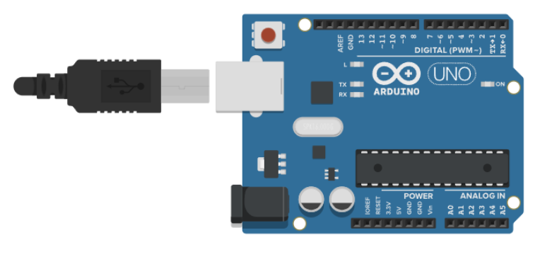

**Video:**[Video del circuito 2 funcionando (YouTube)](https://youtu.be/54HbVc4zJCo?si=KiOWMMvYAZS3Lb-_)
```yml
url: "https://TU_USUARIO.github.io"
baseurl: "/TU_REPO"
```

## 3° Circuito

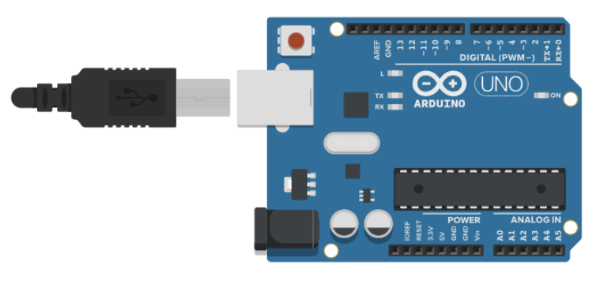

**Video:**[Video del circuito 3 funcionando (YouTube)](https://youtu.be/9MljCZP0cxw?si=lso3rm0hUqpf3Cnv)
```yml
url: "https://TU_USUARIO.github.io"
baseurl: "/TU_REPO"
```
## 4° Circuito

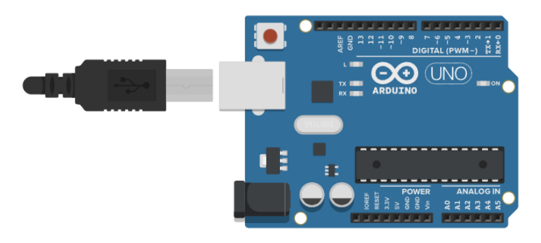

**Video:**[Video del circuito 4 funcionando (YouTube)](https://youtu.be/LJUsGRnbNhs?si=Vp5Rso3VATzhT1fa)
```yml
url: "https://TU_USUARIO.github.io"
baseurl: "/TU_REPO"
```
## 5° Circuito

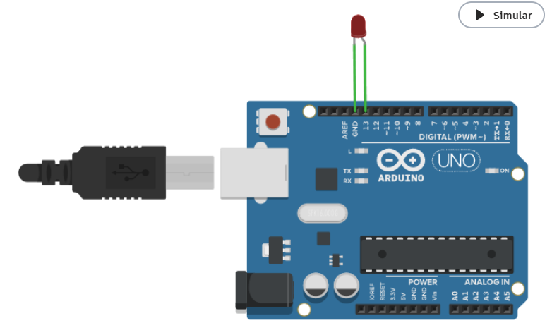

**Video:**[Video del circuito 5 funcionando (YouTube)](https://youtu.be/nQWJhzaKhXI?si=xTUA896019bUI4LW)
```yml
url: "https://TU_USUARIO.github.io"
baseurl: "/TU_REPO"
```
## 6° Circuito

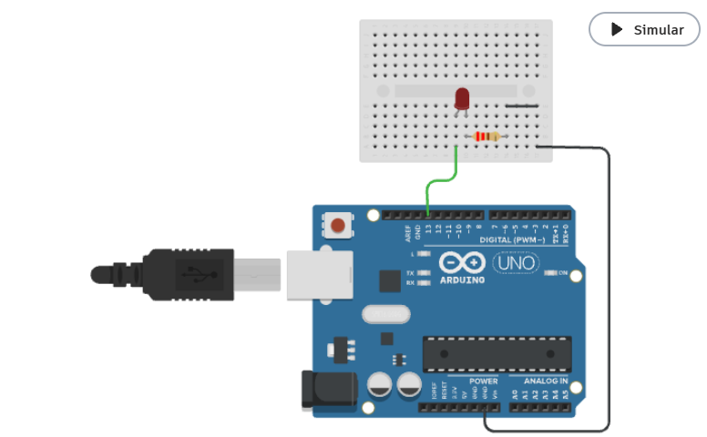

**Video:**[Video del circuito 6 funcionando (YouTube)](https://youtu.be/FgfIBhSvAy4?si=GqUWmPBudOSIK_Ic)
```yml
url: "https://TU_USUARIO.github.io"
baseurl: "/TU_REPO"
```

## 7° Circuito

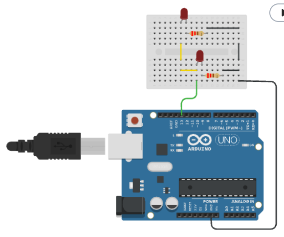

**Video:**[Video del circuito 7 funcionando (YouTube)](https://youtu.be/PPpn34sVRk0?si=RB21A6iZAnimhj-i)
```yml
url: "https://TU_USUARIO.github.io"
baseurl: "/TU_REPO"
```
## 8° Circuito

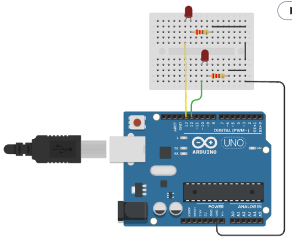

**Video:**[Video del circuito 8 funcionando (YouTube)](https://youtu.be/XIffWv5bJlg?si=nRftB71frYA6Fqhd)
```yml
url: "https://TU_USUARIO.github.io"
baseurl: "/TU_REPO"
```
## 9° Circuito

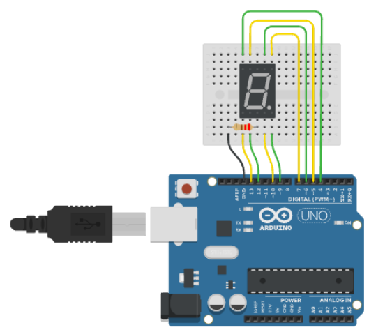

**Video:**[Video del circuito 9 funcionando (YouTube)](https://youtu.be/pmFdMPhLtLw?si=8VfNHsCfAxwyYuut)
```yml
url: "https://TU_USUARIO.github.io"
baseurl: "/TU_REPO"
```
## 10° Circuito

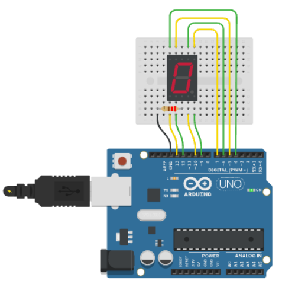

**Video:**[Video del circuito 10 funcionando (YouTube)](https://youtu.be/1Djhibp9MwU?si=X6Ys6APdpAAKXxQu)
```yml 
url: "https://TU_USUARIO.github.io"
baseurl: "/TU_REPO"
```
## 11° Circuito

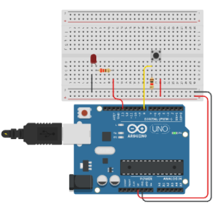

**Video:**[Video del circuito 11 funcionando (YouTube)](https://youtu.be/x4rmQv8Artw?si=59HWQjyqz2z_dLyO)
```yml
url: "https://TU_USUARIO.github.io"
baseurl: "/TU_REPO"
```
## 12° Circuito

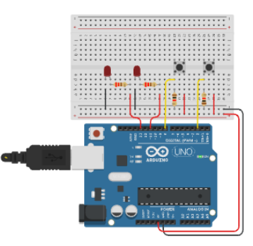

**Video:**[Video del circuito 12 funcionando (YouTube)](https://youtu.be/e91HsMz7TC0?si=h8mLBX680REmPRBF)
```yml
url: "https://TU_USUARIO.github.io"
baseurl: "/TU_REPO"
```
## 13° Circuito

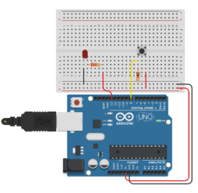

**Video:**[Video del circuito 13 funcionando (YouTube)](https://youtu.be/tY-GWnorAdo?si=8mNczIZf4OHHZR98)
```yml
url: "https://TU_USUARIO.github.io"
baseurl: "/TU_REPO"
```
## 14° Circuito

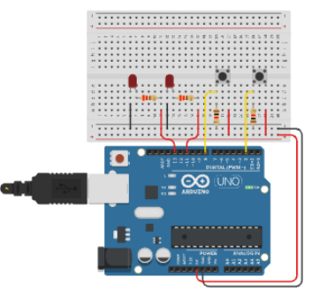

**Video:**[Video del circuito 14 funcionando (YouTube)](https://youtu.be/THGUtYVkBB8?si=s8locrJbJ2duXXFE)
```yml
url: "https://TU_USUARIO.github.io"
baseurl: "/TU_REPO"
```
## 15° Circuito

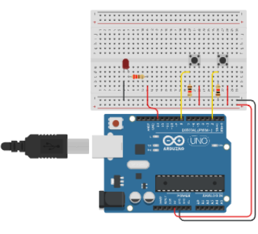

**Video:**[Video del circuito 15 funcionando (YouTube)](https://youtu.be/h30HCgBj6zM?si=bGn3ScuOgziIoCxY)
```yml
url: "https://TU_USUARIO.github.io"
baseurl: "/TU_REPO"
```
## 16° Circuito

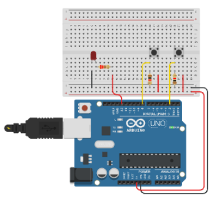

**Video:**[Video del circuito 16 funcionando (YouTube)](https://youtu.be/DiiEJSx_h1g?si=G6smIfZQGmCcW21o)
```yml
url: "https://TU_USUARIO.github.io"
baseurl: "/TU_REPO"
```
## 17° Circuito

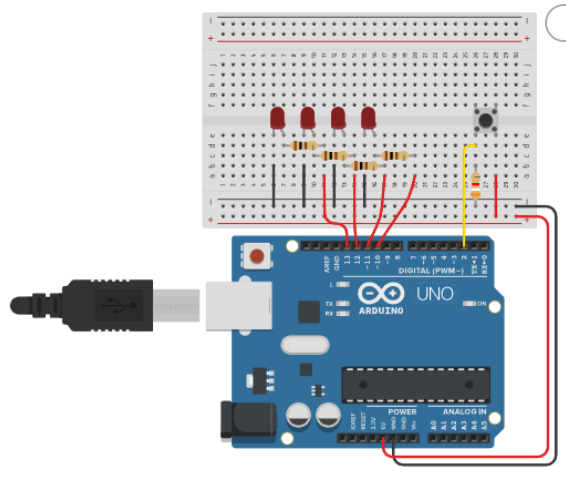

**Video:**[Video del circuito 17 funcionando (YouTube)](https://youtu.be/tkFDoZR8kcc?si=ZEEhFyLY-ftpW8zC)
```yml
url: "https://TU_USUARIO.github.io"
baseurl: "/TU_REPO"
```
## 18° Circuito

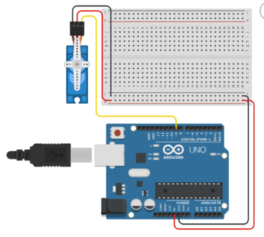

**Video:**[Video del circuito 18 funcionando (YouTube)](https://youtu.be/wxzb1nuZ_Fw?si=5iwkVhriuLhPJsmM)
```yml
url: "https://TU_USUARIO.github.io"
baseurl: "/TU_REPO"
```
## 19° Circuito

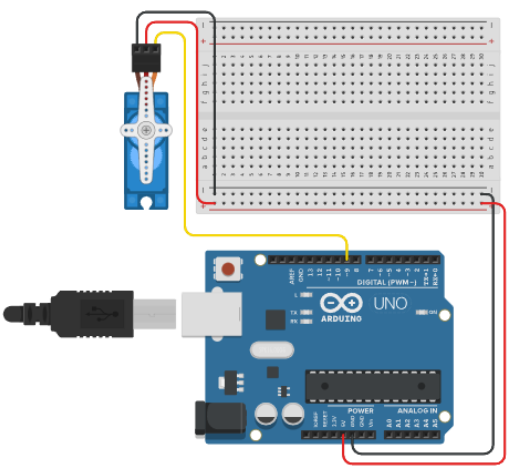

**Video:**[Video del circuito 19 funcionando (YouTube)](https://youtu.be/wxzb1nuZ_Fw?si=5iwkVhriuLhPJsmM)
```yml
url: "https://TU_USUARIO.github.io"
baseurl: "/TU_REPO"
```
## 20° Circuito

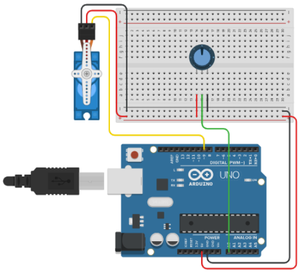

**Video:**[Video del circuito 20 funcionando (YouTube)](https://youtu.be/wxzb1nuZ_Fw?si=5iwkVhriuLhPJsmM)
```yml
url: "https://TU_USUARIO.github.io"
baseurl: "/TU_REPO"
```
# 21° Circuito

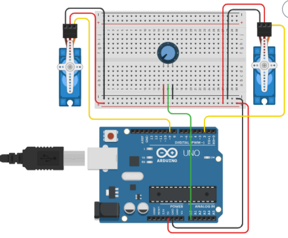

**Video:**[Video del circuito 21 funcionando (YouTube)](https://youtu.be/wxzb1nuZ_Fw?si=5iwkVhriuLhPJsmM)
```yml
url: "https://TU_USUARIO.github.io"
baseurl: "/TU_REPO"
```
# 22° Circuito

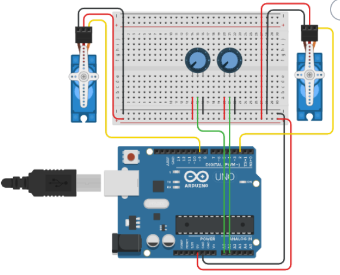

**Video:**[Video del circuito 22 funcionando (YouTube)](https://youtu.be/wxzb1nuZ_Fw?si=5iwkVhriuLhPJsmM)
```yml
url: "https://TU_USUARIO.github.io"
baseurl: "/TU_REPO"
```
# 23° Circuito

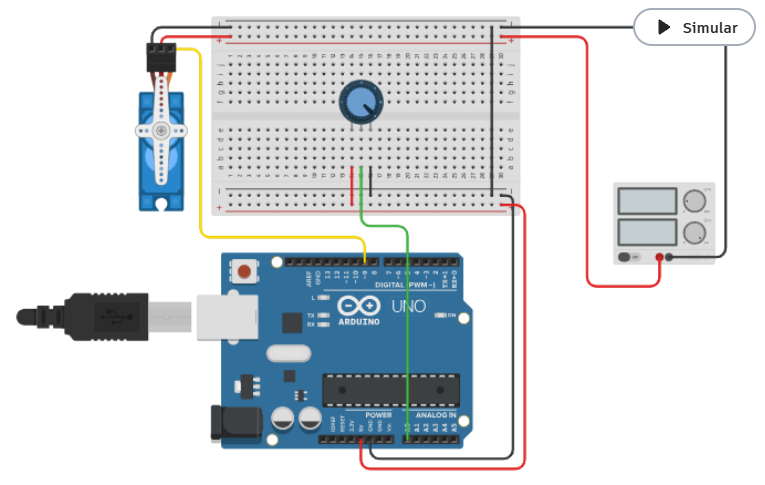

**Video:**[Video del circuito 23 funcionando (YouTube)](https://youtu.be/wxzb1nuZ_Fw?si=5iwkVhriuLhPJsmM)
```yml
url: "https://TU_USUARIO.github.io"
baseurl: "/TU_REPO"
```
## Conclusión 

Aprendí 